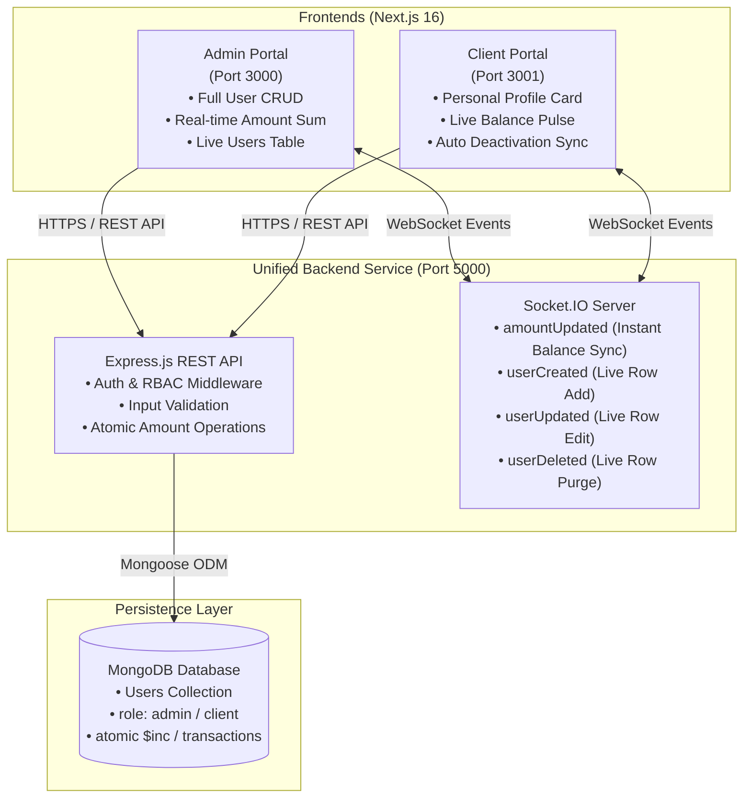

# Techno Prime - Role-Separated Real-Time User Management System

A production-grade **two-application architecture** featuring an **Admin Management Portal** and a **Client Portal**, powered by a unified Node.js/Express + MongoDB backend with **real-time bi-directional synchronization** via Socket.IO and strict **Role-Based Access Control (RBAC)**.

---

## 🏗️ System Architecture



---

## 🚀 Key Functional Features

### 1. Role-Based Access Control (RBAC) Isolation
- **Admin App (`http://localhost:3000`)**: Restricted strictly to users with `role: "admin"`. If a client/user attempts to sign in, the server immediately denies access with `403 Forbidden`.
- **Client App (`http://localhost:3001`)**: Restricted strictly to users with `role: "client"`. If an admin attempts to sign in, access is denied with `403 Forbidden`.
- **Middleware & Proxy**: Both applications utilize Next.js Edge proxy and cookie session verification to guard routes and redirect unauthorized traffic.

### 2. Real-Time Balance Updates & Amount Addition
- In the **Admin Portal**, administrators can edit any user's profile and enter an amount in the **Add Amount (+₹)** field.
- The backend applies atomic updates to the user's balance and immediately broadcasts the `amountUpdated` event via Socket.IO.
- The **Client Portal** reflects the updated balance **in real-time without refreshing the page**, featuring a live credit pulse and status notification.

### 3. Full Real-Time User Management (CRUD)
- **Create User**: Instant live addition across all connected admin tabs without page reload (`userCreated`).
- **Edit User**: Real-time update of name, city, email, mobile, and balance (`userUpdated`).
- **Delete User**: Instant removal from the Admin table (`userDeleted`) and automatic real-time sign-out for any active client session.
- **Client-Side Validation**: Immediate feedback on all fields (10-digit mobile number, valid email format, 8-character password, etc.).

---

## 📂 Project Structure

```
Techno Prime/
├── admin/                     # Admin Web Application (Next.js 16 + Tailwind CSS)
│   ├── app/
│   │   ├── page.tsx           # Admin Dashboard & Client Table
│   │   └── login/page.tsx     # Admin Login Page
│   ├── components/
│   │   ├── ClientModal.tsx    # Add / Edit Client Modal with Amount Field
│   │   ├── ClientTable.tsx    # Real-Time Clients Table
│   │   ├── Clients.tsx        # Container with Socket.IO Listeners
│   │   └── Modal.tsx          # Shared Modal Base Component
│   ├── proxy.ts               # Next.js Authentication Guard
│   └── package.json
│
├── user/                      # Client Web Application (Next.js 16 + Tailwind CSS)
│   ├── app/
│   │   ├── page.tsx           # Client Live Balance & Profile Dashboard
│   │   └── login/page.tsx     # Client Portal Login Page
│   ├── proxy.ts               # Next.js Client Authentication Guard
│   └── package.json
│
└── server/                    # Shared Backend API & WebSocket Server
    ├── controllers/
    │   └── user.controller.ts # Login (RBAC), CRUD & Socket Emitters
    ├── models/
    │   └── user.model.ts      # Mongoose User Schema
    ├── routes/
    │   └── user.routes.ts     # Express REST Endpoints
    ├── validators/
    │   └── user.validator.ts  # Input Schema Validation
    ├── server.ts              # Server Entry Point & Socket.IO Setup
    └── package.json
```

---

## 🛠️ Installation & Setup

### Prerequisites
- Node.js (v18 or higher)
- MongoDB running locally on `mongodb://127.0.0.1:27017` or MongoDB Atlas URI

### 1. Server Setup
```bash
cd server
npm install
npm run dev
```
*Server starts on `http://localhost:5000` and automatically seeds initial credentials.*

### 2. Admin App Setup
```bash
cd admin
npm install
npm run dev
```
*Admin portal runs on `http://localhost:3000`.*

### 3. Client App Setup
```bash
cd user
npm install
npm run dev
```
*Client portal runs on `http://localhost:3001`.*

---

## 🔑 Default Seed Credentials

| Role | Application | Email | Password |
|---|---|---|---|
| **Admin** | Admin Portal (`:3000`) | `admin@example.com` | `admin123` |
| **Client** | Client Portal (`:3001`) | `client@example.com` | `password123` |

---

## 🎥 Demo Video Recording Checklist (3–5 Minutes)

When recording your demonstration for the evaluation team:

1. **Architecture & Project Overview (30s)**:
   - Briefly showcase the workspace directories: `admin`, `user`, and `server`.
2. **Admin Portal Login (`:3000`) (30s)**:
   - Sign in using `admin@example.com` / `admin123`.
   - Point out the User Management Table (`Name`, `City`, `Email`, `Mobile`, `Amount`).
3. **Role Separation Check (30s)**:
   - Try to log in with Admin credentials into the Client Portal (`:3001`) ➔ Show `403: Access Denied`.
   - Try to log in with Client credentials into the Admin Portal (`:3000`) ➔ Show `403: Access Denied`.
4. **Create New User & Real-time Sync (45s)**:
   - Click **"Add user"** in Admin.
   - Show input validation (e.g. 10-digit mobile, valid email).
   - Submit new user (e.g., `rahul@gmail.com` / `password123`).
5. **Real-time Balance Update Demo (Side-by-Side Windows) (1m)**:
   - Place Admin (`:3000`) on the left and Client Portal (`:3001`) on the right.
   - Log in as the newly created user on the right.
   - On the left, click **Edit** on that user, type `+500` in **Add Amount (+₹)**, and click **Save**.
   - Show that the Client Portal on the right **instantly reflects the new summed balance** with live feedback without any page refresh.


const session = await mongoose.startSession();
session.startTransaction()

Atomic Admin Deduction =>
Atomic Deduction & ACID Transaction


const updatedAdmin = await User.findOneAndUpdate(
  {
    _id: adminId,
    role: UserRole.ADMIN,
    amount: { $gte: amountCheck.value },
  },
  { $inc: { amount: -amountCheck.value } }, // 👈 Admin से Minus
  { new: true, session }
);


Transaction commit=> Backend Socket.IO => balance broadcast
balance broadcast =>

const io = getIO();
io.to("admins").emit("adminBalanceUpdated", {
  newAdminBalance: updatedAdmin.amount, // e.g. 99500
  deductedAmount: amountCheck.value,
});


 setAdminBalance(newAdminBalance);